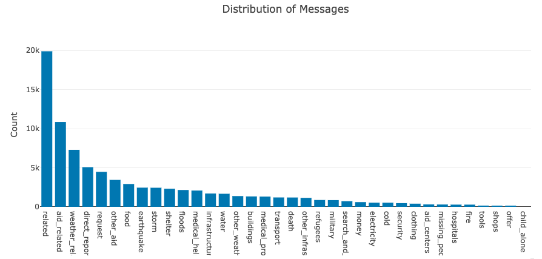

# Disaster Response Pipeline Project

In this project, we analyzed disaster data provided by [Figure Eight](https://www.figure-eight.com/) to build a Natural Language Processing (NLP) model for an API that classifies disaster messages.

The provided data set contains real messages that were sent during disaster events. We have created a machine learning pipeline to categorize these events so that users of the application can send the messages to an appropriate disaster relief agency to take proper and timely action.

The project includes a web application were an emergency worker can input a new message and get classification results in several categories. The web application also displays visualizations of the data.

### Libraries used

We have used the following libraries besides the regular Python Data Science stack:

- Scikit learn
- NLTK
- sqlalchemy

### Project description

The project is divided in three main components:

#### 1. ETL Pipeline

A Python script, `process_data.py`, contains the data cleaning pipeline that:

- Loads the `messages` and `categories` datasets
- Merges the two datasets
- Cleans the data
- Stores it in a SQLite database

#### 2. ML Pipeline

A Python script, `train_classifier.py`, that hold the code of the machine learning pipeline that:

- Loads data from the SQLite database saved before
- Splits the dataset into training and test sets
- Builds a text processing and machine learning pipeline
- Trains and tunes a model using GridSearchCV
- Outputs results on the test set
- Exports the final model as a pickle file

#### 3. Flask Web App

Holds the code of the Web Interface from which the end user will enter the message's text to get the predictions. This page will guide the emergency worker providing predictions about the type of emergency at hand.

#### Files description

The list of the files used in this project are:

```sh
- app
|  - template
|  |- master.html   # main page of web app
|  |- go.html       # classification result page of web app
|- run.py           # Flask file that runs app

- data
|- disaster_categories.csv  # data to process
|- disaster_messages.csv    # data to process
|- process_data.py          # process data and saves it into a database
|- DisasterResponse.db      # database to save clean data to

- models
|- train_classifier.py  # machine learning modeling and prediction
|- classifier.pkl       # saved model

- images
|- English_No-English.png     # English/No-English messages distribution
|- Message_distribution.png   # Messages distribution histogram

- README.md
```


### Instructions:

1. Run the following commands in the project's root directory to set up your database and model.

    - To run ETL pipeline that loads the source CSV files, cleans them and stores the cleaned resulting Pandas Dataframe in a database. Run the following under the `data` directory.

        ```
        python process_data.py disaster_messages.csv disaster_categories.csv DisasterResponse.db
        ```

    - To run ML pipeline that trains classifier and saves the model in a pickle file run the following from the `models` directory:

        ```
        python train_classifier.py ../data/DisasterResponse.db classifier.pkl
        ```

2. Run the following command in the `app` directory to run the web application in order to do predictions:

    ```
    python run.py
    ```

3. Then go to http://0.0.0.0:3001/ to launch the web interface of the application

4. In the box on the top enter the message to classify and click on the "Classify Message" button.

### Acknowledgments

I wan to thank to Stack Overflow and [Scikit Learn](https://scikit-learn.org/stable/index.html) for the terrific information/help and documentation respectively that have make this project possible. Also my class mates in [Udacity](https://www.udacity.com) and my excellent mentor!
